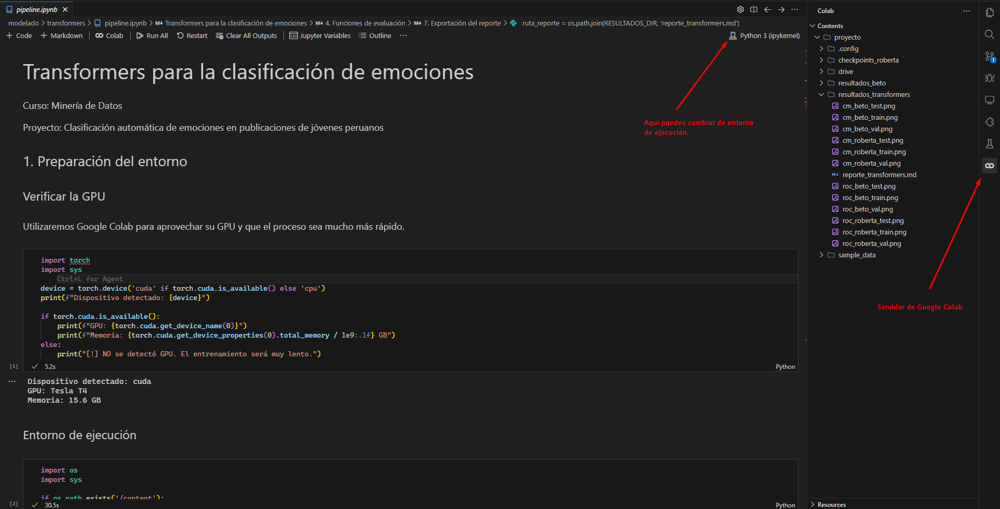

# Clasificación automática de emociones en publicaciones de jóvenes peruanos utilizando técnicas de minería de datos

Proyecto realizado por el grupo 04 del curso de Minería de datos, incorporado por estudiantes de la carrera de Ingeniería de software de la Facultad de Ingeniería de Sistemas e Informática de la UNMSM.

### Stack tecnológico

- Python
- Google Colab
- API Youtube
- Google Cloud Platform
- Jupyter Notebook

### Estructura de carpetas del proyecto

```text
proyecto-mineria-datos
│
├── entregables
│   ├── primer-entregable
│   │   ├── scrapping-youtube-g4
│   │   ├── scrapping-tiktok-g4
│   │   └── Documentacion-Proyecto-Minería-G4.pdf
│   │
│   ├── segundo-entregable
│   │   ├── resultados
│   │   ├── scraping-tiktok
│   │   ├── scraping-youtube
│   │   ├── analisis-emociones-md-grupo04.pdf
│   │   └── Emociones_Preprocesamiento_Grupo04.ipynb
│   │
│   └── tercer-entregable
│   │   ├── resultados
│   │   ├── scrapping-tiktok
│   │   ├── scrapping-youtube
│   │   ├── analisis-emociones-md-grupo04.pdf
│   │   └── Emociones_Preprocesamiento_Grupo04.ipynb
│   └── primer-entregable.zip
│   └── segundo-entregabke.zip
│   └── tercer-entregable.zip
│
├── documentacion
│   ├── analisis-emociones-md-g4.pdf
│   └── enlaces.md
│
├── preprocesamiento
│   ├── scrapping-tiktok-g4
│   ├── scrapping-youtube-g4
│   └── Emociones_Preprocesamiento.ipynb
│
├── modelado
│   ├── datos
│   ├── redes-neuronales
│   ├── resultados_nn
│   ├── resultados_tecnicas-clasicas
│   ├── resultados_transformers
│   ├── tecnicas-clasicas
│   ├── transformers
│   ├── app.py
│   └── requirements.txt
│
├── .gitignore
└── README.md
```

## Ejecución del proyecto

**Recursos del proyecto** (datasets procesados, documentación, etc.) disponibles en el Drive compartido.  
Enlace: [Proyecto-Mineria-G4 — Google Drive](https://drive.google.com/drive/folders/1Uljvi6Wt4v6-hpnu_-VaOJBz81WrIGsS?usp=sharing)  
Más enlaces en [`documentacion/README.md`](./documentacion/README.md).

### 1. Preprocesamiento

El notebook de preprocesamiento genera los datasets limpios y lematizados que consumen los modelos.

**Entorno recomendado:** Google Colab (los datos crudos de scraping están en el Drive del proyecto).

#### Pasos

1. Abre el Drive del proyecto y copia la carpeta `prueba/` (datasets CSV) a tu propio Google Drive.
2. Sube el notebook `preprocesamiento/Emociones_Preprocesamiento.ipynb` a Google Colab.
3. Ejecuta todas las celdas en orden. El notebook monta automáticamente Google Drive y lee los CSV crudos.
4. Los archivos resultantes (`dataset_procesado_*.csv`) se guardan en el Drive. Descárgalos si quieres ejecutar técnicas clásicas de forma local.

### 2. Modelado — Técnicas Clásicas (ejecución local)

El pipeline de técnicas clásicas (SVM, Random Forest, Naive Bayes) corre **completamente en local** y lee los datasets ya procesados desde `modelado/datos/`.

#### Requisitos previos

```bash
# Desde la raíz del repositorio
cd modelado
virtualenv env # Crear entorno virtual
cd env\Scripts\activate
pip install -r requirements.txt
```

#### Pasos

1. Asegúrate de que los archivos `dataset_procesado_*.csv` estén en `modelado/datos/`.  
   Puedes obtenerlos del Drive del proyecto (carpeta `prueba/`) o ejecutando el paso de preprocesamiento.

2. Ejecuta el pipeline:

```bash
python tecnicas-clasicas/pipeline.py
```

3. Los resultados (reporte Markdown, matrices de confusión y curvas ROC para los conjuntos de **entrenamiento, validación y prueba**) se guardan en `modelado/resultados_tecnicas-clasicas/`.

### 3. Modelado — Redes Neuronales (Google Colab)

El pipeline de redes neuronales (CNN y LSTM) requiere GPU y lee los datos **directamente desde Google Drive**.

#### Pasos

1. Accede al Drive del proyecto:  
   [Proyecto-Mineria-G4 — Google Drive](https://drive.google.com/drive/folders/1Uljvi6Wt4v6-hpnu_-VaOJBz81WrIGsS?usp=sharing)

2. Copia la carpeta `prueba/` (con los CSV procesados) a tu Google Drive personal.

3. Abre el notebook `modelado/redes-neuronales/pipeline_nn.ipynb` en **Google Colab** (usa una GPU T4 o superior).

4. Ejecuta las celdas en orden:
   - La primera celda verifica la GPU disponible.
   - La segunda monta Google Drive y configura las rutas automáticamente.
   - Las celdas restantes entrenan los modelos CNN y LSTM con early stopping.

5. Los resultados (gráficas de curva ROC y matriz de confusión para train, val y test) se guardan en `resultados_nn/` dentro del entorno de Colab. Descárgalos al finalizar.

### 4. Modelado — Transformers (Google Colab)

El pipeline de transformers (BETO y RoBERTuito) requiere GPU y también lee los datos **directamente desde Google Drive**.

#### Pasos

1. Accede al Drive del proyecto:  
   [Proyecto-Mineria-G4 — Google Drive](https://drive.google.com/drive/folders/1Uljvi6Wt4v6-hpnu_-VaOJBz81WrIGsS?usp=sharing)

2. Copia la carpeta `prueba/` (con los CSV procesados) a tu Google Drive personal.

3. Abre el notebook `modelado/transformers/pipeline.ipynb` en **Google Colab** (usa una GPU T4 o superior).

4. Instala las dependencias ejecutando la celda de instalación (primera celda de código tras la verificación de GPU):

   ```
   !pip install transformers datasets pysentimiento evaluate accelerate scikit-learn pandas matplotlib seaborn openpyxl
   ```

5. Ejecuta las celdas en orden:
   - Las primeras celdas verifican la GPU y montan Google Drive.
   - Se entrenan los modelos **BETO** (`dccuchile/bert-base-spanish-wwm-cased`) y **RoBERTuito** (`pysentimiento/robertuito-base-uncased`) con early stopping.
   - Al finalizar se generan matrices de confusión y curvas ROC para **entrenamiento, validación y prueba**, más el reporte Markdown consolidado.

6. Los resultados se guardan en `resultados_transformers/` dentro del entorno de Colab. Descárgalos al finalizar.

> Nota: Para el proyecto, utilizamos la extensión de Google Colab para Visual Studio Code, nos permite cambiar de entorno de ejecución y utilizar recursos como la GPU desde VSCode de manera remota.

Pasos para utilizar la extensión de Google Colab para Visual Studio Code:

1. Asegúrate de tener la extensión de Google Colab para Visual Studio Code.
2. Abrir el notebook en VSCode.
3. Seleccionar el entorno de ejecución.
4. Cambiar de entorno a GPU T4 o superior.
5. Crea el servidor con un nombre.
6. Selecciona el kernel de Python.
7. Ejecuta el notebook.

> Los resultados se guardan en el servidor de Colab, puedes descargarlos desde la barra lateral izquierda.


