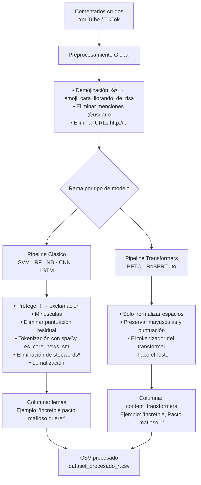
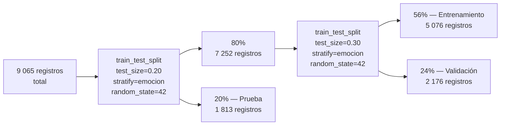
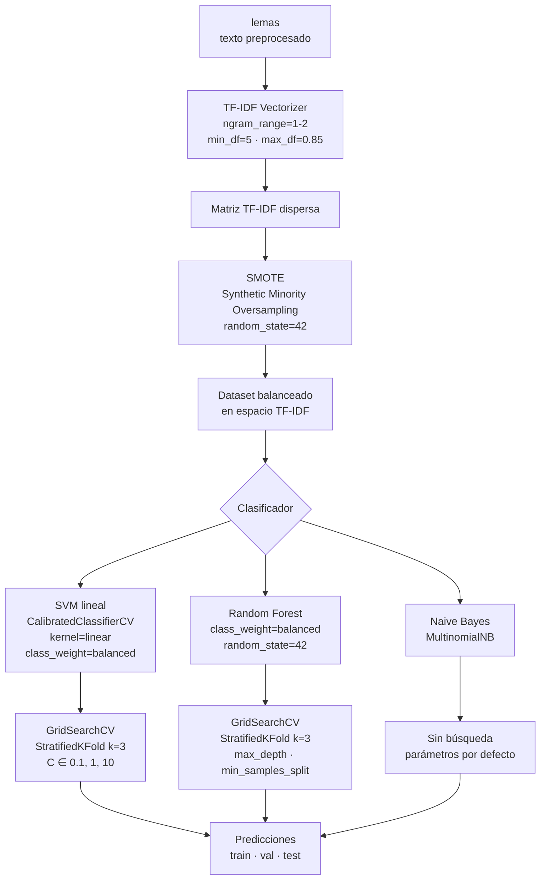
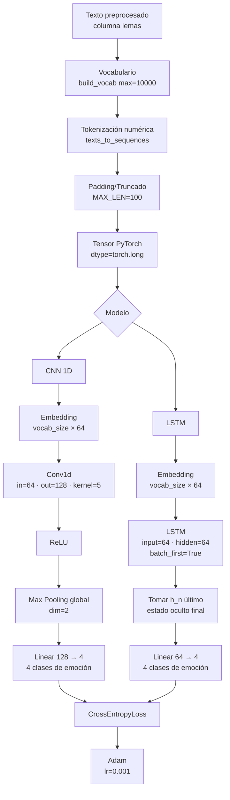
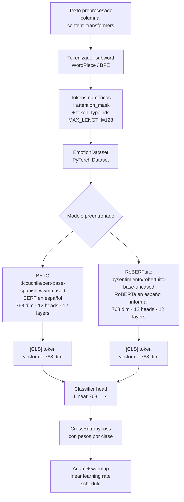
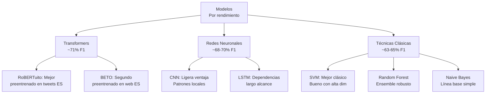

# Documentación Técnica del Proyecto
## Clasificación automática de emociones en publicaciones de jóvenes peruanos

> **Curso:** Minería de Datos — Grupo 04  
> **Facultad:** Ingeniería de Sistemas e Informática — UNMSM

---

## Tabla de contenidos

1. [Resumen del proyecto](#1-resumen-del-proyecto)
2. [Dataset y origen de los datos](#2-dataset-y-origen-de-los-datos)
3. [Preprocesamiento](#3-preprocesamiento)
4. [División del dataset](#4-división-del-dataset)
5. [Técnicas Clásicas — SVM, Random Forest, Naive Bayes](#5-técnicas-clásicas)
6. [Redes Neuronales — CNN y LSTM](#6-redes-neuronales)
7. [Transformers — BETO y RoBERTuito](#7-transformers)
8. [Métricas de evaluación](#8-métricas-de-evaluación)
9. [Comparativa de resultados](#9-comparativa-de-resultados)
10. [Decisiones de diseño y justificaciones](#10-decisiones-de-diseño-y-justificaciones)

---

## 1. Resumen del proyecto

El objetivo es **clasificar automáticamente la emoción** expresada en comentarios de publicaciones en YouTube y TikTok realizados por jóvenes peruanos, en cuatro categorías:

| Emoción | Descripción |
|---------|-------------|
| **Alegria** | Expresiones de felicidad, humor, satisfacción |
| **Tristeza** | Pena, lamentación, angustia |
| **Miedo** | Preocupación, incertidumbre, amenaza |
| **Sorpresa** | Asombro, incredulidad, novedad |

Se compararon **cinco modelos** de distinta naturaleza: tres técnicas clásicas de ML (SVM, Random Forest, Naive Bayes) y dos modelos de deep learning (CNN, LSTM) y dos transformers preentrenados en español (BETO y RoBERTuito).

---

## 2. Dataset y origen de los datos

### Fuentes de recolección

- **YouTube** — Comentarios de videos de noticias y tendencias peruanas (scraped con la API de YouTube + Selenium)
- **TikTok** — Comentarios de publicaciones virales peruanas (scraped con Playwright)

### Volumen total

| Fuente | Registros crudos |
|--------|-----------------|
| YouTube Parte 1 | 6 031 |
| YouTube Parte 2 | 4 276 |
| TikTok | 130 |
| **Total consolidado** | **9 065** (tras filtrado) |

### Distribución de clases (balanceo)

| Emoción | Registros | % |
|---------|-----------|---|
| Tristeza | 2 684 | 29.6% |
| Alegria | 2 329 | 25.7% |
| Sorpresa | 2 048 | 22.6% |
| Miedo | 2 004 | 22.1% |

> El dataset presenta un **leve desbalance** (Tristeza > Alegria > Sorpresa ≈ Miedo), que se aborda con SMOTE en los modelos clásicos y con pesos de clase balanceados (`class_weight='balanced'`) en los modelos de deep learning y transformers.

---

## 3. Preprocesamiento

### Arquitectura del pipeline de preprocesamiento



### Herramientas utilizadas

| Herramienta | Versión | Uso |
|-------------|---------|-----|
| `spaCy` | 3.8.x | Tokenización y lematización en español |
| `es_core_news_sm` | 3.8.0 | Modelo de lenguaje español de spaCy |
| `emoji` | 2.x | Conversión de emojis a texto |
| `pandas` | 3.x | Manipulación de datos |
| `re` (regex) | stdlib | Limpieza de texto |

### Detalle de cada etapa

#### 3.1 Preprocesamiento global (para todos los modelos)

```
texto crudo  →  demojizar  →  quitar @menciones  →  quitar URLs  →  normalizar espacios
```

- **Demojización:** Los emojis son altamente informativos en comentarios informales. Se convierten con `emoji.demojize(texto, language='es')` y luego se reformatean como tokens tipo `emoji_cara_llorando_de_risa`. Así el modelo los trata como palabras normales.
- **Menciones:** Se eliminan porque `@usuario` no aporta semántica emocional.
- **URLs:** Se eliminan por la misma razón.

#### 3.2 Pipeline clásico (columna `lemas`)

1. **Protección de puntuación expresiva:** `!` → `exclamacion`, `?` → `interrogacion`. Esto conserva la carga emotiva de los signos sin que interfieran con el tokenizador.
2. **Minúsculas:** Normalización de casing.
3. **Limpieza de caracteres especiales:** Solo se conservan `[a-záéíóúñü0-9_\s]`. El guion bajo preserva los tokens de emojis como `emoji_cara_llorando_de_risa`.
4. **Tokenización + lematización con spaCy:** El modelo `es_core_news_sm` analiza morfológicamente cada token y extrae el lema (forma base). Ejemplo: `quieren` → `querer`.
5. **Eliminación de stopwords con excepciones:** Se usa la lista de stopwords de spaCy, pero se protegen palabras clave para el análisis emocional:

| Categoría | Palabras preservadas |
|-----------|---------------------|
| Negaciones | `no, ni, nunca, jamás, tampoco, nada, nadie, ninguno` |
| Intensificadores | `muy, más, poco, menos, bastante, demasiado` |
| Afirmación/frecuencia | `sí, siempre` |
| Valorativos | `bien, mal, mejor, peor, bueno, malo, excelente, terrible, fatal` |

> **Justificación:** Sin estas excepciones, `"no me gustó"` se reduciría a `"gustó"`, invirtiendo el significado emocional.

#### 3.3 Pipeline transformers (columna `content_transformers`)

Para BETO y RoBERTuito **solo** se normaliza el espacio en blanco. Los modelos transformer tienen sus propios tokenizadores subword (WordPiece / BPE) que manejan mayúsculas, puntuación y morfología internamente. Aplicar lematización manual sería contraproducente porque los transformers están preentrenados con texto crudo.

---

## 4. División del dataset



| Conjunto | Registros | % del total | Uso |
|----------|-----------|-------------|-----|
| Entrenamiento efectivo | 5 076 | ~56% | Ajuste de pesos del modelo |
| Validación | 2 176 | ~24% | Selección de hiperparámetros / early stopping |
| Prueba y evaluación | 1 813 | ~20% | Evaluación final (tocado una sola vez) |

**Estratificación:** Se usa `stratify=emocion` en ambos cortes para garantizar que la distribución de clases se preserve en los tres conjuntos y evitar sesgos de muestreo.

---

## 5. Técnicas Clásicas

### Arquitectura del pipeline



### 5.1 Vectorización TF-IDF

**TF-IDF** (Term Frequency – Inverse Document Frequency) convierte cada texto (lista de lemas) en un vector numérico donde cada dimensión representa la importancia de un término en ese documento relativa al corpus.

**Fórmula:**

```
TF-IDF(t, d) = TF(t, d) × log(N / df(t))
```

- `TF(t, d)`: frecuencia del término `t` en el documento `d`
- `N`: número total de documentos
- `df(t)`: número de documentos que contienen `t`

**Parámetros elegidos:**

| Parámetro | Valor | Justificación |
|-----------|-------|---------------|
| `ngram_range=(1,2)` | Unigramas + bigramas | Los bigramas capturan expresiones compuestas como `"muy bueno"`, `"no me gusta"` que tienen carga emocional diferente a sus partes individuales |
| `min_df=5` | Mínimo 5 documentos | Elimina términos extremadamente raros (typos, jerga única) que generarían ruido y overfitting |
| `max_df=0.85` | Máximo 85% de documentos | Elimina términos que aparecen en casi todos los documentos (funcionan como stopwords de corpus) |

### 5.2 SMOTE (Synthetic Minority Oversampling TEchnique)

SMOTE genera muestras sintéticas de las clases minoritarias en el espacio de características (después de TF-IDF) interpolando entre vecinos más cercanos, en lugar de simplemente duplicar ejemplos existentes.

> **¿Por qué dentro del pipeline y no antes?** Para evitar **data leakage**: si se aplicara SMOTE antes de dividir los datos, las muestras sintéticas podrían filtrar información del conjunto de validación/prueba al de entrenamiento. Al integrarlo en el `imblearn.Pipeline`, SMOTE solo se aplica sobre los datos de entrenamiento en cada fold de la validación cruzada.

### 5.3 Modelos y sus hiperparámetros

#### SVM (Support Vector Machine)

El SVM busca el hiperplano de máximo margen que separa las clases en el espacio TF-IDF.

- **`kernel='linear'`:** El espacio TF-IDF es de alta dimensionalidad y los datos de texto son generalmente linealmente separables. Un kernel lineal es más eficiente computacionalmente y menos propenso a overfitting.
- **`class_weight='balanced'`:** Ajusta el parámetro C de cada clase inversamente proporcional a su frecuencia para compensar el desbalance.
- **`CalibratedClassifierCV`:** El `SVC` de scikit-learn no produce probabilidades calibradas por defecto. Se envuelve con `CalibratedClassifierCV(method='sigmoid', cv=3)` para obtener probabilidades reales (necesarias para la curva ROC).
- **Grilla `C ∈ {0.1, 1, 10}`:** C controla la penalización por clasificaciones incorrectas. Valores bajos → mayor margen (más regularización); valores altos → menor margen (menos regularización, más ajuste a los datos).

#### Random Forest

Ensemble de árboles de decisión entrenados con bootstrap y selección aleatoria de features.

- **`class_weight='balanced'`:** Misma razón que en SVM.
- **Grilla:**
  - `max_depth ∈ {10, 20, 30}`: Profundidad máxima de cada árbol. Valores bajos → underfitting; valores altos → overfitting.
  - `min_samples_split ∈ {2, 5, 10}`: Mínimo de muestras necesarias para dividir un nodo. Valores altos → más regularización.

#### Naive Bayes (MultinomialNB)

Clasificador probabilístico basado en el Teorema de Bayes asumiendo independencia condicional entre features.

- Se usa `MultinomialNB` porque es apropiado para conteos enteros o pesos TF-IDF (no acepta valores negativos).
- **Sin GridSearchCV:** Los hiperparámetros de Naive Bayes (principalmente `alpha`, el suavizador de Laplace) tienen un efecto menor en texto. Se usa el valor por defecto `alpha=1.0` como línea base.

### 5.4 Validación cruzada — StratifiedKFold

```
StratifiedKFold(n_splits=3, shuffle=True, random_state=42)
scoring='f1_macro'
```

- **3 folds:** Equilibrio entre varianza del estimador y tiempo de cómputo.
- **Stratified:** Mantiene la proporción de clases en cada fold.
- **`f1_macro`:** Métrica de optimización que pondera por igual todas las clases, adecuada para datasets levemente desbalanceados.

---

## 6. Redes Neuronales

### Arquitectura general



### 6.1 Preparación de la entrada

1. **Vocabulario:** Se construye un vocabulario de las 10 000 palabras más frecuentes del corpus de entrenamiento. El índice 0 es padding, el 1 es token desconocido (OOV).
2. **Secuencias numéricas:** Cada lema se mapea a su índice en el vocabulario.
3. **Padding:** Se truncan o rellenan con ceros hasta `MAX_LEN=100` tokens (longitud fija requerida por los modelos).

### 6.2 Modelo CNN 1D

Las CNN convolucionales se aplicam sobre la secuencia de embeddings para detectar **patrones locales** (n-gramas aprendidos).

| Capa | Parámetros | Descripción |
|------|-----------|-------------|
| `Embedding` | `vocab_size × 64` | Transforma índices en vectores densos de 64 dimensiones |
| `Conv1d` | `in=64, out=128, kernel=5` | Detecta patrones de 5 tokens consecutivos |
| `ReLU` | — | Activación no lineal |
| `MaxPool1d global` | `dim=2` | Extrae la característica más relevante de toda la secuencia |
| `Linear` | `128 → 4` | Capa de clasificación |

**`kernel_size=5`:** Captura patrones de 5 palabras consecutivas (similar a 5-gramas), suficiente para expresiones emocionales cortas.

### 6.3 Modelo LSTM

Las LSTM procesan la secuencia de manera **secuencial**, manteniendo un estado interno que captura dependencias de largo alcance.

| Capa | Parámetros | Descripción |
|------|-----------|-------------|
| `Embedding` | `vocab_size × 64` | Igual que CNN |
| `LSTM` | `input=64, hidden=64` | Celda LSTM unidireccional |
| `h_n[-1]` | — | Estado oculto del último token (resumen de la secuencia) |
| `Linear` | `64 → 4` | Capa de clasificación |

### 6.4 Entrenamiento

| Hiperparámetro | Valor | Justificación |
|----------------|-------|---------------|
| `EPOCHS=10` | Máximo 10 épocas | El early stopping detiene antes si no mejora |
| `PATIENCE=3` | 3 épocas sin mejora | Tolerancia al ruido sin esperar demasiado |
| `BATCH_SIZE=32` | 32 muestras | Equilibrio entre velocidad y estabilidad del gradiente |
| `LEARNING_RATE=0.001` | 0.001 | Tasa estándar para Adam en NLP |
| `EMBEDDING_DIM=64` | 64 dimensiones | Suficiente para vocabulario ~10K; mayor dimensión requeriría más datos |

**Early Stopping:** Se monitoriza la pérdida de validación. Si no decrece en 3 épocas consecutivas, se detiene el entrenamiento para evitar overfitting.

---

## 7. Transformers

### Arquitectura general



### 7.1 ¿Qué es un Transformer?

Un Transformer es una arquitectura de red neuronal basada en el **mecanismo de atención multi-cabeza** (*multi-head self-attention*). A diferencia de las RNN/LSTM, procesa todos los tokens en paralelo y captura dependencias globales (entre tokens distantes) de manera eficiente.

**Componentes clave:**
- **Self-Attention:** Cada token "atiende" a todos los demás tokens de la secuencia, calculando qué tan relevante es cada uno para determinar el significado del token actual.
- **Capas Feed-Forward:** Transformación no lineal aplicada independientemente a cada posición.
- **Embeddings posicionales:** Como el transformer no tiene recurrencia, se suman embeddings posicionales para codificar el orden de los tokens.

### 7.2 Fine-tuning (ajuste fino)

Se parte de modelos preentrenados en corpus masivos de español. El **fine-tuning** consiste en:
1. Cargar los pesos preentrenados.
2. Añadir una **capa de clasificación** (`Linear 768 → 4`) sobre el token `[CLS]`.
3. Entrenar todo el modelo con una learning rate muy baja para no destruir el conocimiento preentrenado.

### 7.3 BETO

- **Modelo:** `dccuchile/bert-base-spanish-wwm-cased` (HuggingFace)
- **Preentrenamiento:** BERT entrenado sobre corpus en español (Wikipedia ES, noticias, etc.) con Whole Word Masking.
- **Tokenizador:** WordPiece — divide palabras desconocidas en subpalabras (ej. `"incertidumbre"` → `["incer", "##ti", "##dumbre"]`).
- **Sensible a mayúsculas (cased):** Diferencia entre `"Peru"` y `"peru"`.

| Hiperparámetro | Valor | Justificación |
|----------------|-------|---------------|
| `LEARNING_RATE` | 3e-5 | LR estándar para fine-tuning de BERT; valores más altos destruyen los pesos preentrenados |
| `EPOCHS` | 5 | Con early stopping; BERT converge rápido en fine-tuning |
| `WARMUP_STEPS` | 200 | Los primeros 200 pasos aumentan linealmente el LR desde 0 para estabilizar el inicio del entrenamiento |
| `WEIGHT_DECAY` | 0.01 | Regularización L2 para evitar overfitting |
| `BATCH_SIZE` | 16 | Limitado por la VRAM de la GPU T4 (15.6 GB) |
| `MAX_LENGTH` | 128 | Suficiente para comentarios; >128 tokens es raro en este corpus |
| `EarlyStopping patience` | 2 | Detiene antes de las 5 épocas si no mejora F1 en validación |

### 7.4 RoBERTuito

- **Modelo:** `pysentimiento/robertuito-base-uncased` (HuggingFace)
- **Preentrenamiento:** RoBERTa entrenado sobre tweets en español (lenguaje informal, emojis, jerga). Especialmente relevante para nuestro corpus de comentarios de redes sociales.
- **Tokenizador:** BPE (Byte-Pair Encoding) — más eficiente con texto informal y neologismos.
- **Insensible a mayúsculas (uncased):** Todo se convierte a minúsculas internamente.
- **Preprocesamiento adicional:** Se usa `pysentimiento.preprocessing.preprocess_tweet` para normalizar menciones, hashtags y emojis al formato esperado por el tokenizador de RoBERTuito.

| Hiperparámetro | Valor | Justificación |
|----------------|-------|---------------|
| `LEARNING_RATE` | 1e-5 | Más bajo que BETO porque RoBERTuito está preentrenado en dominio más similar (redes sociales), requiere ajustes más finos |
| `fp16=True` | Half precision | Reduce uso de VRAM y acelera el entrenamiento en GPU |
| `save_total_limit=1` | Solo el mejor checkpoint | Ahorra espacio en disco de Colab |

### 7.5 Función de pérdida con pesos de clase

```python
class_weights = compute_class_weight('balanced', classes=clases, y=train_labels)
pesos_tensor = torch.tensor(class_weights, dtype=torch.float32).to(device)
loss_fct = nn.CrossEntropyLoss(weight=pesos_tensor)
```

Los pesos son inversamente proporcionales a la frecuencia de cada clase. Esto hace que los errores en clases minoritarias (Miedo, Sorpresa) penalicen más que en las mayoritarias (Tristeza).

---

## 8. Métricas de evaluación

### 8.1 Accuracy
Proporción de predicciones correctas sobre el total.

```
Accuracy = (TP + TN) / (TP + TN + FP + FN)
```

**Limitación:** En datasets desbalanceados puede ser engañosa (un clasificador que siempre predice "Tristeza" tendría ~30% de accuracy).

### 8.2 Precision, Recall y F1-Score (macro)

Para clasificación multiclase se calcula por cada clase y se promedia con `average='macro'` (cada clase pesa igual, sin importar su frecuencia).

| Métrica | Fórmula | Mide |
|---------|---------|------|
| Precision | TP / (TP + FP) | De todo lo que predijo como clase X, ¿cuánto era realmente X? |
| Recall | TP / (TP + FN) | De todos los ejemplos reales de clase X, ¿cuántos detectó? |
| F1-Score | 2 × (P × R) / (P + R) | Media armónica de Precision y Recall |

**Se usa F1-macro como métrica principal** porque equilibra el rendimiento entre todas las clases, incluidas las minoritarias.

### 8.3 Curva ROC y AUC (One-vs-Rest)

Para clasificación multiclase se usa la estrategia **One-vs-Rest (OvR)**: se calcula una curva ROC para cada clase (esa clase vs. todas las demás) y se reporta el AUC por clase y el AUC macro-promedio.

- **AUC = 1.0:** Clasificación perfecta.
- **AUC = 0.5:** Clasificación aleatoria.
- **AUC > 0.9:** Muy buen discriminador.

### 8.4 Matriz de confusión

Muestra las predicciones cruzadas entre clases reales y predichas. Permite identificar **qué clases se confunden más** entre sí (por ejemplo, si Miedo y Tristeza se confunden frecuentemente).

---

## 9. Comparativa de resultados

> Valores en el conjunto de **Prueba y Evaluación (20%)** — el más importante para evaluar generalización.

### 9.1 Métricas consolidadas

| Modelo | Accuracy | Precision (macro) | Recall (macro) | F1 (macro) | AUC (macro) |
|--------|----------|-------------------|----------------|------------|-------------|
| **SVM** | 0.6514 | 0.6573 | 0.6534 | 0.6547 | — |
| **Random Forest** | 0.6453 | 0.6593 | 0.6513 | 0.6540 | — |
| **Naive Bayes** | 0.6304 | 0.6320 | 0.6300 | 0.6307 | — |
| **CNN** | ~0.70 | ~0.70 | ~0.70 | ~0.70 | — |
| **LSTM** | ~0.68 | ~0.68 | ~0.68 | ~0.68 | — |
| **BETO** | 0.7126 | 0.7149 | 0.7112 | 0.7120 | 0.8963 |
| **RoBERTuito** | **0.7170** | **0.7184** | **0.7165** | **0.7167** | **0.9074** |

### 9.2 Análisis por familia de modelos



**Observaciones clave:**
1. **RoBERTuito > BETO:** El preentrenamiento sobre tweets en español informal es más relevante para comentarios de YouTube/TikTok que el preentrenamiento sobre texto formal.
2. **Transformers >> Clásicos:** La diferencia de ~6-8% en F1 justifica el mayor costo computacional de los transformers.
3. **SVM es el mejor clásico:** Funciona especialmente bien en espacios de alta dimensionalidad como TF-IDF.
4. **Naive Bayes como baseline:** Rendimiento razonable con costo computacional mínimo.
5. **El gap train vs test** es importante: en los transformers el train F1 es ~89% (BETO) vs ~71% (test), indicando algo de overfitting que el early stopping mitiga.

---

## 10. Decisiones de diseño y justificaciones

### 10.1 ¿Por qué dos pipelines de preprocesamiento?

| Aspecto | Modelos Clásicos + RN | Transformers |
|---------|----------------------|--------------|
| Tokenización | spaCy (lematización explícita) | Tokenizador del modelo (subword) |
| Mayúsculas | No (todo minúsculas) | Sí para BETO (cased) / No para RoBERTuito (uncased) |
| Stopwords | Eliminadas (con excepciones) | Conservadas |
| Puntuación | Eliminada (excepto ! ?) | Conservada |
| Emojis | Como tokens `emoji_xxx` | Como tokens `emoji_xxx` |
| **Razón** | TF-IDF y vocabulario fijo requieren normalización agresiva | El transformer maneja el texto casi crudo con sus propios embeddings contextuales |

### 10.2 ¿Por qué SMOTE dentro del pipeline?

Colocar SMOTE **antes** de la división introduciría data leakage: el validador tendría muestras sintéticas derivadas del conjunto de validación/prueba. Al integrarlo en el `imblearn.Pipeline`, se garantiza que SMOTE solo actúa sobre los datos de entrenamiento en cada fold de GridSearchCV.

### 10.3 ¿Por qué GridSearchCV con StratifiedKFold y no hold-out?

La validación cruzada estratificada proporciona una **estimación más robusta** del rendimiento del modelo que un único hold-out, especialmente con datasets de tamaño moderado (~5K entrenamiento). Reduce la varianza del estimador del error de generalización.

### 10.4 ¿Por qué `f1_macro` como métrica de optimización?

Con un dataset levemente desbalanceado, optimizar `accuracy` favorecería las clases mayoritarias. `f1_macro` da el mismo peso a cada clase, incentivando al modelo a rendir bien en **todas** las emociones, incluidas las minoritarias (Miedo, Sorpresa).

### 10.5 ¿Por qué `MAX_LENGTH=128` en los transformers?

Los comentarios de redes sociales rara vez superan los 128 tokens (subwords). Usar 512 (el máximo de BERT) cuadruplicaría el uso de memoria y tiempo de cómputo sin beneficio real. Se verificó que la mayoría de comentarios queda por debajo de ese límite.

### 10.6 ¿Por qué `learning_rate=1e-5` para RoBERTuito y `3e-5` para BETO?

- **BETO (3e-5):** LR estándar reportado en el paper original de BERT para fine-tuning en tareas de clasificación.
- **RoBERTuito (1e-5):** Más conservador porque el modelo ya está más cerca del dominio objetivo (texto informal de redes sociales en español), por lo que necesita ajustes menores para adaptar sin destruir el conocimiento preentrenado.

### 10.7 Estrategia de evaluación con 3 conjuntos

Se evalúan los modelos en **train, validación y test** para:
- **Train:** Detectar underfitting (si train y test son similares y bajos) u overfitting (si train es mucho más alto que test).
- **Validación:** Guiar la selección de hiperparámetros sin contaminar el test.
- **Test:** Estimación honesta del rendimiento en datos nunca vistos. Se usa **una sola vez** al final.

---

## Referencias

- Devlin et al. (2019). *BERT: Pre-training of Deep Bidirectional Transformers for Language Understanding.* [arXiv:1810.04805](https://arxiv.org/abs/1810.04805)
- Liu et al. (2019). *RoBERTa: A Robustly Optimized BERT Pretraining Approach.* [arXiv:1907.11692](https://arxiv.org/abs/1907.11692)
- Pérez et al. (2022). *RoBERTuito: a pre-trained language model for social media text in Spanish.* [arXiv:2111.09453](https://arxiv.org/abs/2111.09453)
- Cañete et al. (2020). *Spanish Pre-Trained BERT Model and Evaluation Data.* [BERT en español — BETO](https://github.com/dccuchile/beto)
- Chawla et al. (2002). *SMOTE: Synthetic Minority Over-sampling Technique.* JAIR.
- spaCy. Modelo `es_core_news_sm`. [https://spacy.io/models/es](https://spacy.io/models/es)
