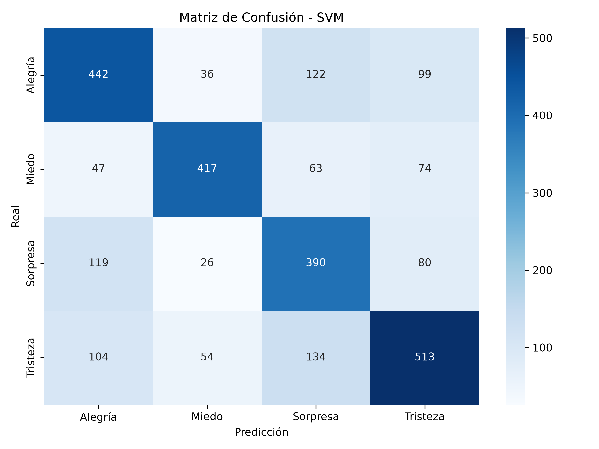
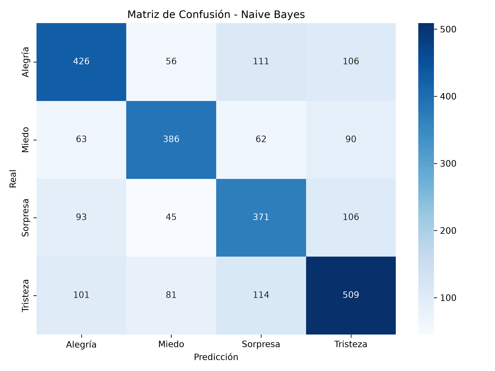
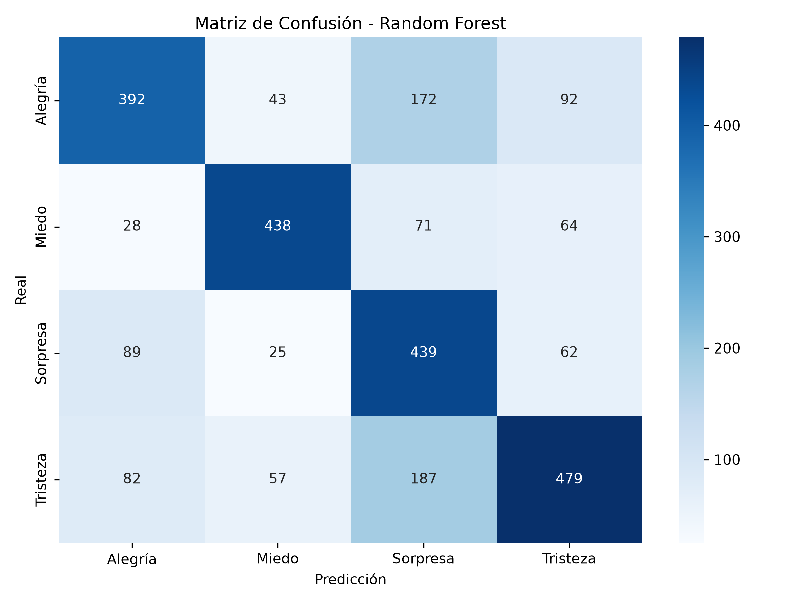

# Reporte de Evaluación de Modelos Clásicos

Resultados de las métricas de rendimiento tras aplicar mejoras contra el sobreajuste (Vectorización Tfidf ajustada, SMOTE para balanceo y restricciones de profundidad en Random Forest).

## SVM

### Resultados en el Conjunto de Entrenamiento (SMOTE)
- **Accuracy:** 0.8405
- **Precision (macro):** 0.8450
- **Recall (macro):** 0.8405
- **F1-Score (macro):** 0.8409

```text
              precision    recall  f1-score   support

     Alegría       0.85      0.80      0.82      1879
       Miedo       0.91      0.83      0.87      1879
    Sorpresa       0.77      0.90      0.83      1879
    Tristeza       0.85      0.83      0.84      1879

    accuracy                           0.84      7516
   macro avg       0.85      0.84      0.84      7516
weighted avg       0.85      0.84      0.84      7516

```

### Resultados en el Conjunto de Prueba (30%)
- **Accuracy:** 0.6478
- **Precision (macro):** 0.6557
- **Recall (macro):** 0.6494
- **F1-Score (macro):** 0.6510

```text
              precision    recall  f1-score   support

     Alegría       0.62      0.63      0.63       699
       Miedo       0.78      0.69      0.74       601
    Sorpresa       0.55      0.63      0.59       615
    Tristeza       0.67      0.64      0.65       805

    accuracy                           0.65      2720
   macro avg       0.66      0.65      0.65      2720
weighted avg       0.65      0.65      0.65      2720

```

**Matriz de Confusión:**



## Naive Bayes

### Resultados en el Conjunto de Entrenamiento (SMOTE)
- **Accuracy:** 0.7545
- **Precision (macro):** 0.7569
- **Recall (macro):** 0.7545
- **F1-Score (macro):** 0.7549

```text
              precision    recall  f1-score   support

     Alegría       0.73      0.70      0.72      1879
       Miedo       0.83      0.76      0.79      1879
    Sorpresa       0.71      0.78      0.75      1879
    Tristeza       0.76      0.77      0.76      1879

    accuracy                           0.75      7516
   macro avg       0.76      0.75      0.75      7516
weighted avg       0.76      0.75      0.75      7516

```

### Resultados en el Conjunto de Prueba (30%)
- **Accuracy:** 0.6221
- **Precision (macro):** 0.6237
- **Recall (macro):** 0.6218
- **F1-Score (macro):** 0.6224

```text
              precision    recall  f1-score   support

     Alegría       0.62      0.61      0.62       699
       Miedo       0.68      0.64      0.66       601
    Sorpresa       0.56      0.60      0.58       615
    Tristeza       0.63      0.63      0.63       805

    accuracy                           0.62      2720
   macro avg       0.62      0.62      0.62      2720
weighted avg       0.62      0.62      0.62      2720

```

**Matriz de Confusión:**



## Random Forest

### Resultados en el Conjunto de Entrenamiento (SMOTE)
- **Accuracy:** 0.7567
- **Precision (macro):** 0.7843
- **Recall (macro):** 0.7567
- **F1-Score (macro):** 0.7595

```text
              precision    recall  f1-score   support

     Alegría       0.82      0.63      0.71      1879
       Miedo       0.90      0.80      0.85      1879
    Sorpresa       0.60      0.87      0.71      1879
    Tristeza       0.82      0.72      0.77      1879

    accuracy                           0.76      7516
   macro avg       0.78      0.76      0.76      7516
weighted avg       0.78      0.76      0.76      7516

```

### Resultados en el Conjunto de Prueba (30%)
- **Accuracy:** 0.6426
- **Precision (macro):** 0.6584
- **Recall (macro):** 0.6496
- **F1-Score (macro):** 0.6474

```text
              precision    recall  f1-score   support

     Alegría       0.66      0.56      0.61       699
       Miedo       0.78      0.73      0.75       601
    Sorpresa       0.51      0.71      0.59       615
    Tristeza       0.69      0.60      0.64       805

    accuracy                           0.64      2720
   macro avg       0.66      0.65      0.65      2720
weighted avg       0.66      0.64      0.65      2720

```

**Matriz de Confusión:**



