# Reporte de evaluación - Redes Neuronales

Resultados de métricas de rendimiento para los modelos CNN y LSTM.

---

## CNN

### Resultados en Entrenamiento Efectivo (~56%)

#### CNN_train

- **Accuracy:** 0.9884
- **Precision (macro):** 0.9886
- **Sensibilidad/Recall (macro):** 0.9886
- **F1-Score (macro):** 0.9886

```text
              precision    recall  f1-score   support

     Alegria       0.99      0.98      0.99      1304
       Miedo       0.99      0.99      0.99      1122
    Sorpresa       0.99      0.99      0.99      1147
    Tristeza       0.98      0.99      0.99      1503

    accuracy                           0.99      5076
   macro avg       0.99      0.99      0.99      5076
weighted avg       0.99      0.99      0.99      5076

```

**Matriz de Confusión:**

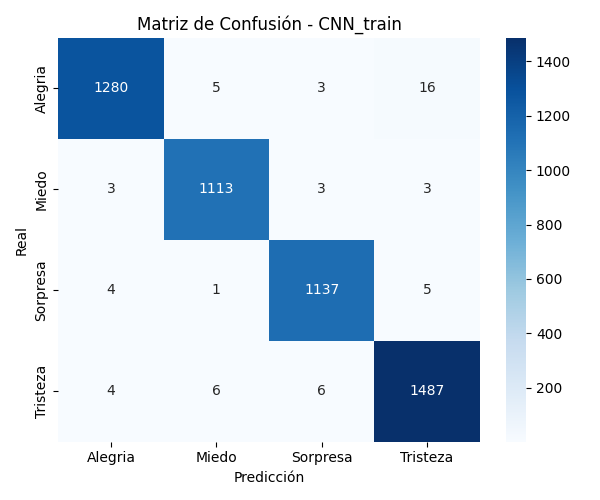

**Curva ROC / AUC:**

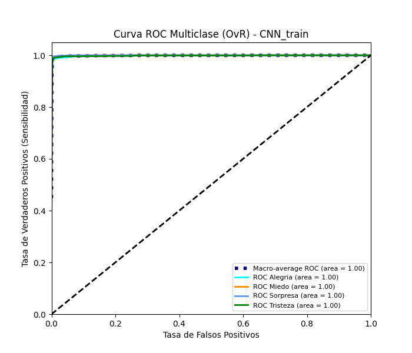

### Resultados en Validación (~24%)

#### CNN_val

- **Accuracy:** 0.5611
- **Precision (macro):** 0.5611
- **Sensibilidad/Recall (macro):** 0.5598
- **F1-Score (macro):** 0.5597

```text
              precision    recall  f1-score   support

     Alegria       0.50      0.54      0.52       559
       Miedo       0.71      0.70      0.71       481
    Sorpresa       0.46      0.40      0.43       492
    Tristeza       0.57      0.60      0.58       644

    accuracy                           0.56      2176
   macro avg       0.56      0.56      0.56      2176
weighted avg       0.56      0.56      0.56      2176

```

**Matriz de Confusión:**


**Curva ROC / AUC:**

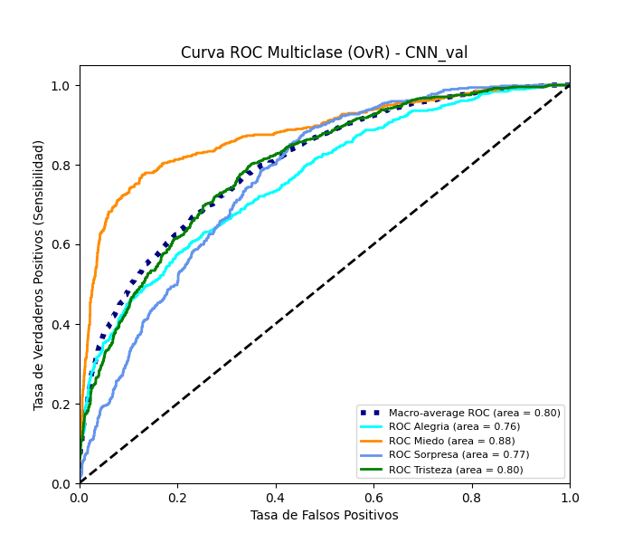

### Resultados en Prueba y Evaluación (20%)

#### CNN_test

- **Accuracy:** 0.5742
- **Precision (macro):** 0.5784
- **Sensibilidad/Recall (macro):** 0.5733
- **F1-Score (macro):** 0.5753

```text
              precision    recall  f1-score   support

     Alegria       0.52      0.56      0.54       466
       Miedo       0.72      0.68      0.70       401
    Sorpresa       0.50      0.46      0.48       409
    Tristeza       0.57      0.60      0.59       537

    accuracy                           0.57      1813
   macro avg       0.58      0.57      0.58      1813
weighted avg       0.58      0.57      0.57      1813

```

**Matriz de Confusión:**

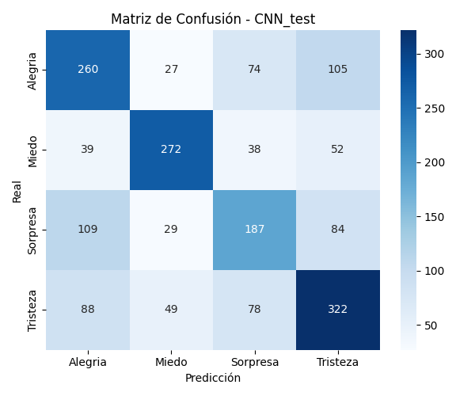

**Curva ROC / AUC:**

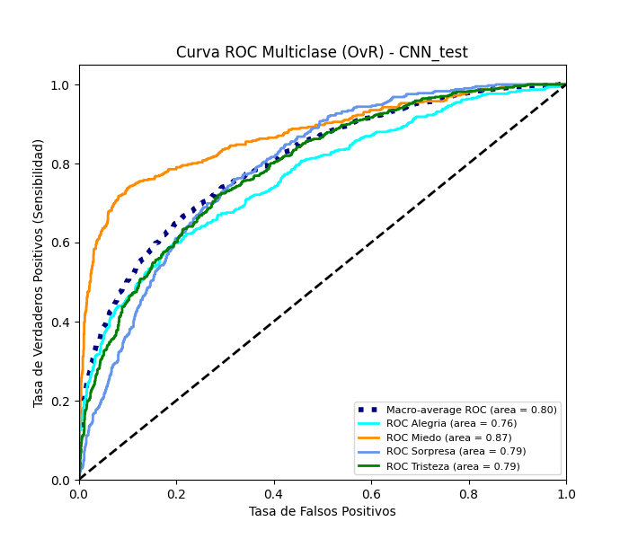

---

## LSTM

### Resultados en Entrenamiento Efectivo (~56%)

#### LSTM_train

- **Accuracy:** 0.8712
- **Precision (macro):** 0.8754
- **Sensibilidad/Recall (macro):** 0.8694
- **F1-Score (macro):** 0.8711

```text
              precision    recall  f1-score   support

     Alegria       0.92      0.82      0.87      1304
       Miedo       0.91      0.88      0.89      1122
    Sorpresa       0.84      0.86      0.85      1147
    Tristeza       0.84      0.92      0.88      1503

    accuracy                           0.87      5076
   macro avg       0.88      0.87      0.87      5076
weighted avg       0.87      0.87      0.87      5076

```

**Matriz de Confusión:**

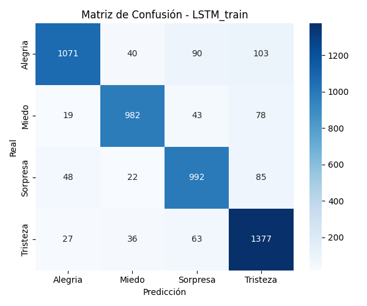

**Curva ROC / AUC:**

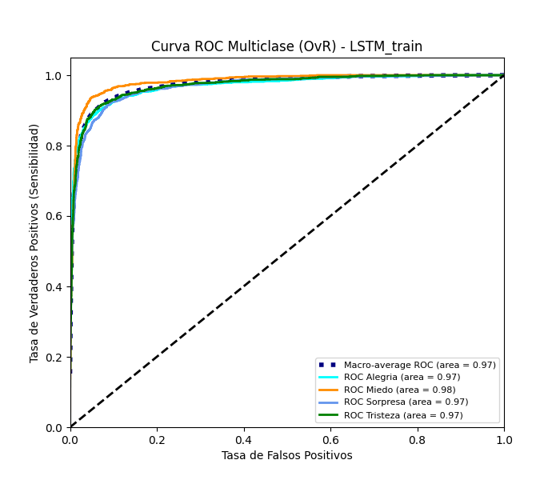

### Resultados en Validación (~24%)

#### LSTM_val

- **Accuracy:** 0.5584
- **Precision (macro):** 0.5644
- **Sensibilidad/Recall (macro):** 0.5550
- **F1-Score (macro):** 0.5576

```text
              precision    recall  f1-score   support

     Alegria       0.55      0.48      0.52       559
       Miedo       0.72      0.67      0.69       481
    Sorpresa       0.44      0.42      0.43       492
    Tristeza       0.54      0.64      0.58       644

    accuracy                           0.56      2176
   macro avg       0.56      0.55      0.56      2176
weighted avg       0.56      0.56      0.56      2176

```

**Matriz de Confusión:**

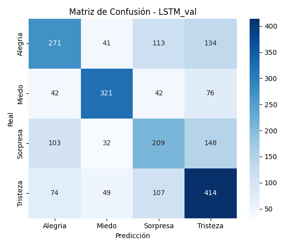

**Curva ROC / AUC:**

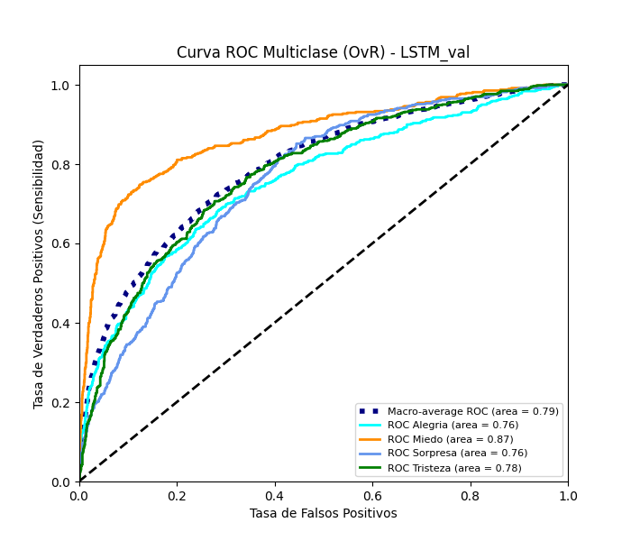

### Resultados en Prueba y Evaluación (20%)

#### LSTM_test

- **Accuracy:** 0.5593
- **Precision (macro):** 0.5714
- **Sensibilidad/Recall (macro):** 0.5547
- **F1-Score (macro):** 0.5581

```text
              precision    recall  f1-score   support

     Alegria       0.58      0.45      0.50       466
       Miedo       0.73      0.64      0.68       401
    Sorpresa       0.46      0.45      0.46       409
    Tristeza       0.52      0.67      0.59       537

    accuracy                           0.56      1813
   macro avg       0.57      0.55      0.56      1813
weighted avg       0.57      0.56      0.56      1813

```

**Matriz de Confusión:**

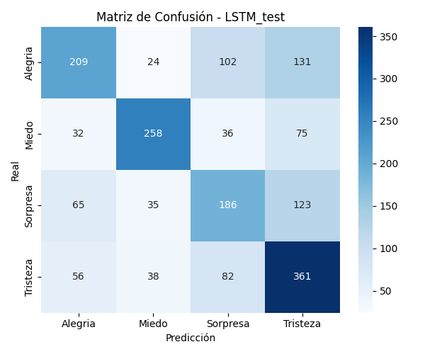

**Curva ROC / AUC:**

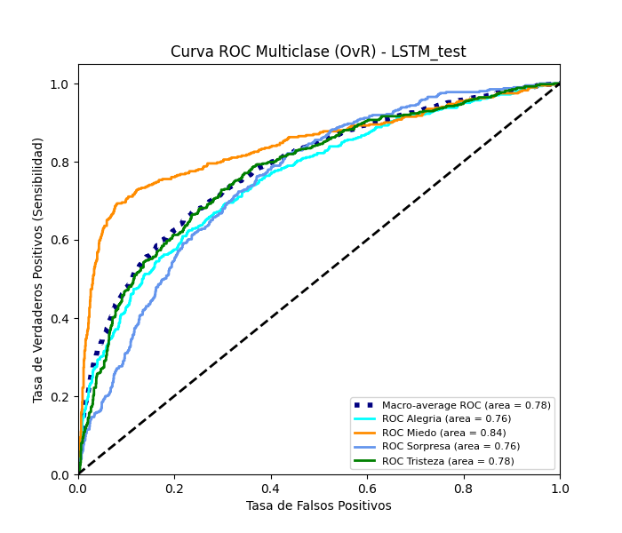

