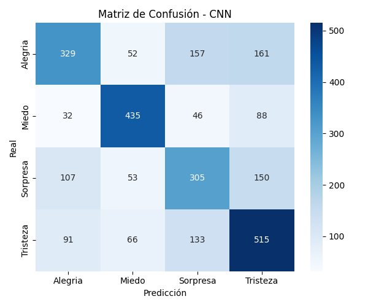
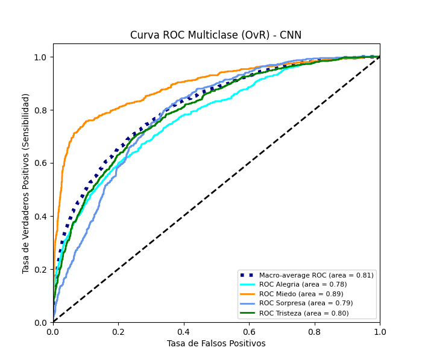
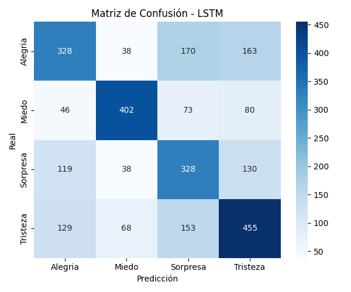
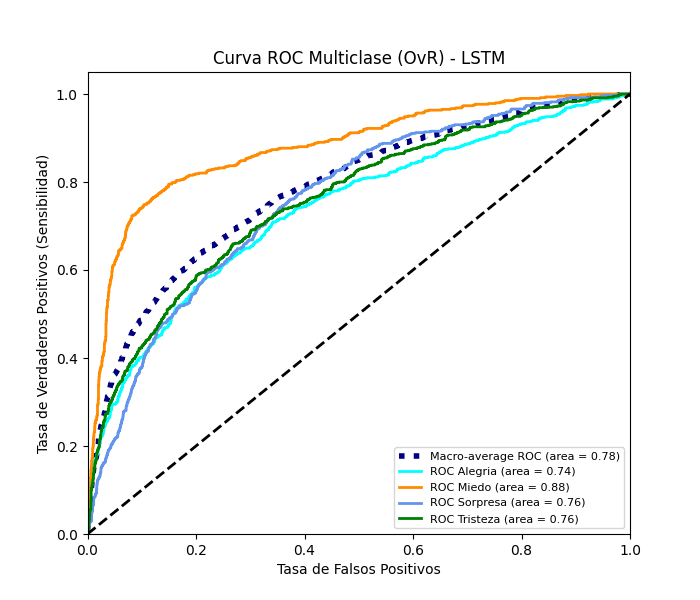

# Reporte de evaluación de redes neuronales profundas

Resultados de las métricas de rendimiento para los modelos CNN y LSTM.

## CNN

- **Accuracy:** 0.5824
- **Precision (macro):** 0.5864
- **Sensibilidad/Recall (macro):** 0.5825
- **F1-Score (macro):** 0.5822

```text
              precision    recall  f1-score   support

     Alegria       0.59      0.47      0.52       699
       Miedo       0.72      0.72      0.72       601
    Sorpresa       0.48      0.50      0.49       615
    Tristeza       0.56      0.64      0.60       805

    accuracy                           0.58      2720
   macro avg       0.59      0.58      0.58      2720
weighted avg       0.58      0.58      0.58      2720

```

**Matriz de Confusión:**



**Curva ROC / AUC:**



## LSTM

- **Accuracy:** 0.5563
- **Precision (macro):** 0.5665
- **Sensibilidad/Recall (macro):** 0.5592
- **F1-Score (macro):** 0.5612

```text
              precision    recall  f1-score   support

     Alegria       0.53      0.47      0.50       699
       Miedo       0.74      0.67      0.70       601
    Sorpresa       0.45      0.53      0.49       615
    Tristeza       0.55      0.57      0.56       805

    accuracy                           0.56      2720
   macro avg       0.57      0.56      0.56      2720
weighted avg       0.56      0.56      0.56      2720

```

**Matriz de Confusión:**



**Curva ROC / AUC:**



