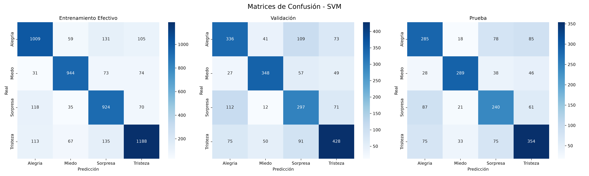
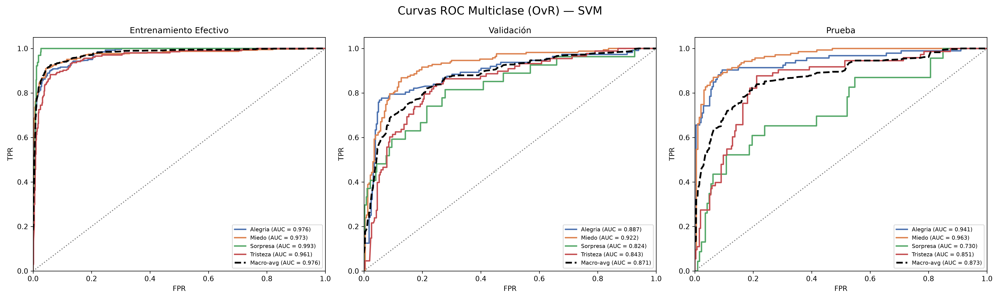
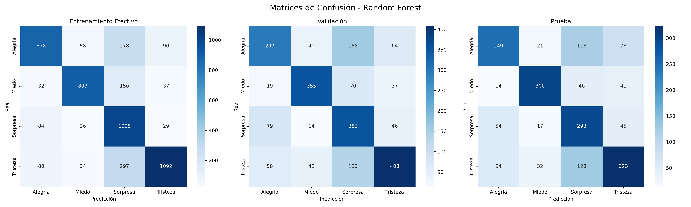
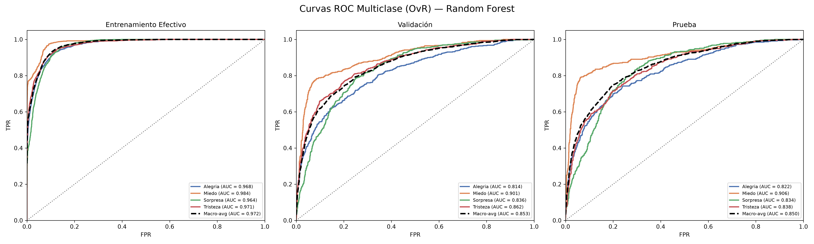
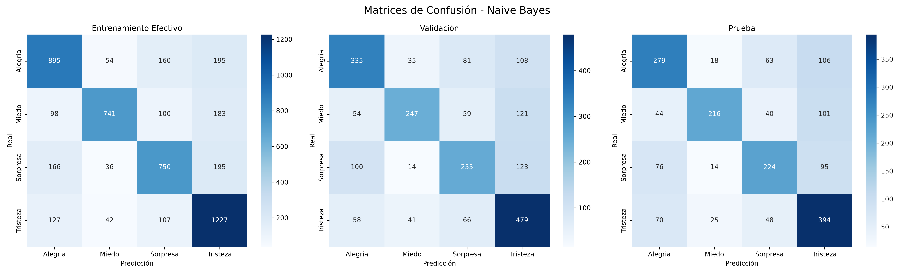
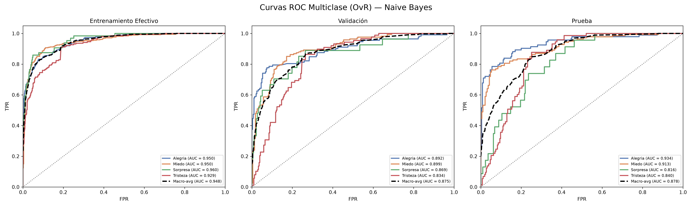

# Reporte de Evaluación de Modelos Clásicos

## División de Datos

| Conjunto | Registros | % del total |
|---|---|---|
| Entrenamiento Efectivo | 917 | ~55.9% |
| Validación | 394 | ~24.0% |
| Prueba y Evaluación | 328 | ~20.0% |
| **Total** | **1639** | **100%** |

## Distribución por Emoción

| Emoción | Entren. Efectivo | Validación | Prueba |
|---|---|---|---|
| Alegria | 262 | 112 | 93 |
| Miedo | 387 | 167 | 139 |
| Sorpresa | 64 | 27 | 23 |
| Tristeza | 204 | 88 | 73 |
| **Total** | **917** | **394** | **328** |

---

## SVM

### Resultados en el Conjunto de Entrenamiento Efectivo (~56%)
- **Accuracy:** 0.8691
- **Precision (macro):** 0.8624
- **Recall (macro):** 0.8141
- **F1-Score (macro):** 0.8337

```text
              precision    recall  f1-score   support

     Alegria       0.84      0.90      0.87       262
       Miedo       0.90      0.94      0.92       387
    Sorpresa       0.86      0.66      0.74        64
    Tristeza       0.86      0.75      0.80       204

    accuracy                           0.87       917
   macro avg       0.86      0.81      0.83       917
weighted avg       0.87      0.87      0.87       917

```

**AUC ROC (Entrenamiento):**
- Macro-average: 0.9762
- Alegria: 0.9758
- Miedo: 0.9732
- Sorpresa: 0.9934
- Tristeza: 0.9613

### Resultados en el Conjunto de Validación (~24%)
- **Accuracy:** 0.7538
- **Precision (macro):** 0.7095
- **Recall (macro):** 0.6369
- **F1-Score (macro):** 0.6530

```text
              precision    recall  f1-score   support

     Alegria       0.75      0.79      0.77       112
       Miedo       0.83      0.88      0.85       167
    Sorpresa       0.64      0.26      0.37        27
    Tristeza       0.63      0.61      0.62        88

    accuracy                           0.75       394
   macro avg       0.71      0.64      0.65       394
weighted avg       0.75      0.75      0.74       394

```

**AUC ROC (Validación):**
- Macro-average: 0.8706
- Alegria: 0.8871
- Miedo: 0.9216
- Sorpresa: 0.8243
- Tristeza: 0.8434

### Resultados en el Conjunto de Prueba y Evaluación (20%)
- **Accuracy:** 0.7683
- **Precision (macro):** 0.6488
- **Recall (macro):** 0.6282
- **F1-Score (macro):** 0.6316

```text
              precision    recall  f1-score   support

     Alegria       0.80      0.87      0.84        93
       Miedo       0.86      0.91      0.88       139
    Sorpresa       0.33      0.17      0.23        23
    Tristeza       0.60      0.56      0.58        73

    accuracy                           0.77       328
   macro avg       0.65      0.63      0.63       328
weighted avg       0.75      0.77      0.76       328

```

**AUC ROC (Prueba):**
- Macro-average: 0.8731
- Alegria: 0.9409
- Miedo: 0.9629
- Sorpresa: 0.7303
- Tristeza: 0.8509

### Gráficas de Evaluación Conjuntas

**Matrices de Confusión:**



**Curvas ROC:**



---

## Random Forest

### Resultados en el Conjunto de Entrenamiento Efectivo (~56%)
- **Accuracy:** 0.9128
- **Precision (macro):** 0.8879
- **Recall (macro):** 0.9290
- **F1-Score (macro):** 0.9032

```text
              precision    recall  f1-score   support

     Alegria       0.98      0.86      0.92       262
       Miedo       0.96      0.91      0.94       387
    Sorpresa       0.80      0.98      0.88        64
    Tristeza       0.81      0.96      0.88       204

    accuracy                           0.91       917
   macro avg       0.89      0.93      0.90       917
weighted avg       0.92      0.91      0.91       917

```

**AUC ROC (Entrenamiento):**
- Macro-average: 0.9940
- Alegria: 0.9922
- Miedo: 0.9914
- Sorpresa: 0.9992
- Tristeza: 0.9925

### Resultados en el Conjunto de Validación (~24%)
- **Accuracy:** 0.7741
- **Precision (macro):** 0.7064
- **Recall (macro):** 0.6743
- **F1-Score (macro):** 0.6838

```text
              precision    recall  f1-score   support

     Alegria       0.80      0.77      0.79       112
       Miedo       0.88      0.88      0.88       167
    Sorpresa       0.53      0.33      0.41        27
    Tristeza       0.62      0.72      0.66        88

    accuracy                           0.77       394
   macro avg       0.71      0.67      0.68       394
weighted avg       0.77      0.77      0.77       394

```

**AUC ROC (Validación):**
- Macro-average: 0.8962
- Alegria: 0.9074
- Miedo: 0.9516
- Sorpresa: 0.8258
- Tristeza: 0.8922

### Resultados en el Conjunto de Prueba y Evaluación (20%)
- **Accuracy:** 0.7530
- **Precision (macro):** 0.6349
- **Recall (macro):** 0.6290
- **F1-Score (macro):** 0.6291

```text
              precision    recall  f1-score   support

     Alegria       0.85      0.74      0.79        93
       Miedo       0.93      0.90      0.92       139
    Sorpresa       0.23      0.22      0.22        23
    Tristeza       0.53      0.66      0.59        73

    accuracy                           0.75       328
   macro avg       0.63      0.63      0.63       328
weighted avg       0.77      0.75      0.76       328

```

**AUC ROC (Prueba):**
- Macro-average: 0.9107
- Alegria: 0.9359
- Miedo: 0.9664
- Sorpresa: 0.8587
- Tristeza: 0.8755

### Gráficas de Evaluación Conjuntas

**Matrices de Confusión:**



**Curvas ROC:**



---

## Naive Bayes

### Resultados en el Conjunto de Entrenamiento Efectivo (~56%)
- **Accuracy:** 0.7437
- **Precision (macro):** 0.8329
- **Recall (macro):** 0.5833
- **F1-Score (macro):** 0.5989

```text
              precision    recall  f1-score   support

     Alegria       0.81      0.83      0.82       262
       Miedo       0.69      0.95      0.80       387
    Sorpresa       1.00      0.11      0.20        64
    Tristeza       0.83      0.45      0.58       204

    accuracy                           0.74       917
   macro avg       0.83      0.58      0.60       917
weighted avg       0.78      0.74      0.71       917

```

**AUC ROC (Entrenamiento):**
- Macro-average: 0.9478
- Alegria: 0.9504
- Miedo: 0.9502
- Sorpresa: 0.9601
- Tristeza: 0.9289

### Resultados en el Conjunto de Validación (~24%)
- **Accuracy:** 0.6599
- **Precision (macro):** 0.7271
- **Recall (macro):** 0.5008
- **F1-Score (macro):** 0.4990

```text
              precision    recall  f1-score   support

     Alegria       0.75      0.79      0.77       112
       Miedo       0.63      0.90      0.74       167
    Sorpresa       1.00      0.11      0.20        27
    Tristeza       0.53      0.19      0.28        88

    accuracy                           0.66       394
   macro avg       0.73      0.50      0.50       394
weighted avg       0.67      0.66      0.61       394

```

**AUC ROC (Validación):**
- Macro-average: 0.8750
- Alegria: 0.8919
- Miedo: 0.8986
- Sorpresa: 0.8687
- Tristeza: 0.8342

### Resultados en el Conjunto de Prueba y Evaluación (20%)
- **Accuracy:** 0.6524
- **Precision (macro):** 0.4609
- **Recall (macro):** 0.4670
- **F1-Score (macro):** 0.4362

```text
              precision    recall  f1-score   support

     Alegria       0.80      0.80      0.80        93
       Miedo       0.61      0.94      0.74       139
    Sorpresa       0.00      0.00      0.00        23
    Tristeza       0.43      0.14      0.21        73

    accuracy                           0.65       328
   macro avg       0.46      0.47      0.44       328
weighted avg       0.58      0.65      0.59       328

```

**AUC ROC (Prueba):**
- Macro-average: 0.8781
- Alegria: 0.9339
- Miedo: 0.9133
- Sorpresa: 0.8164
- Tristeza: 0.8401

### Gráficas de Evaluación Conjuntas

**Matrices de Confusión:**



**Curvas ROC:**



---

