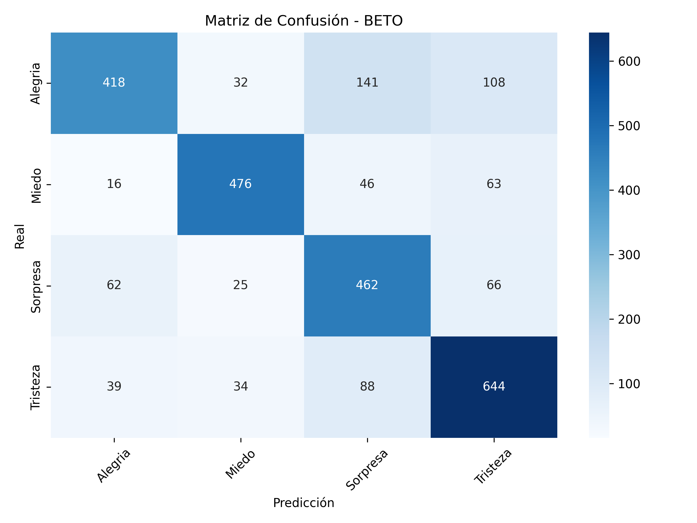
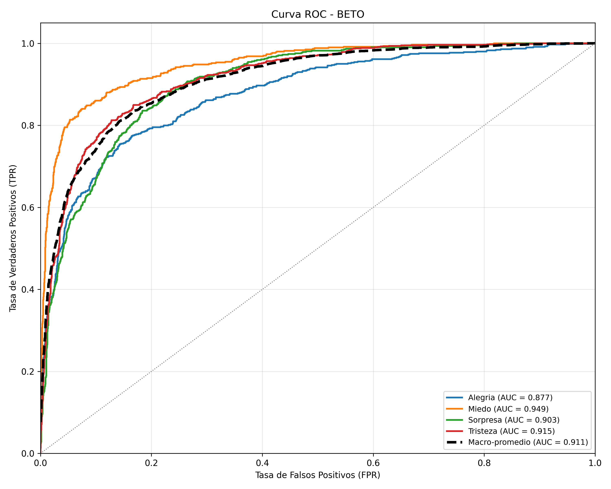
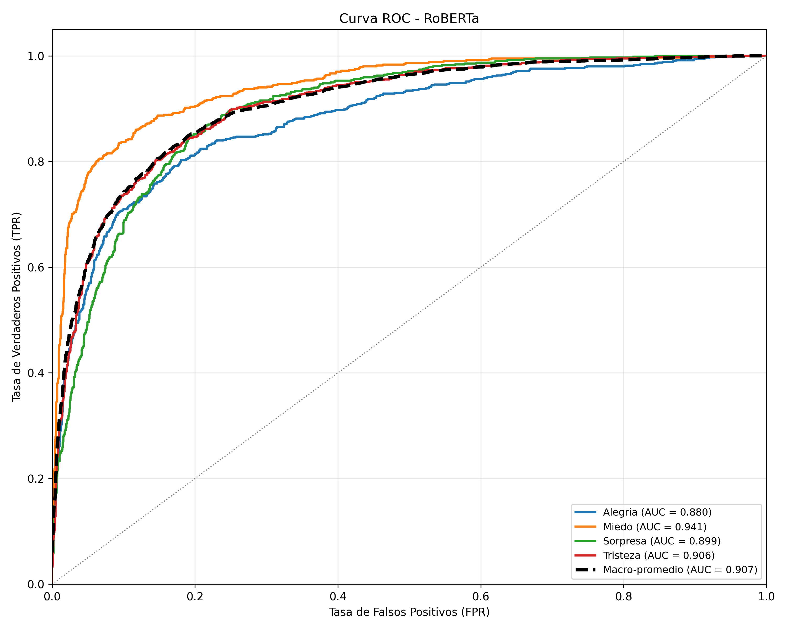

# Reporte de evaluación de modelos Transformer

## Comparativa Global

| Métrica           | BETO   | RoBERTa |
| ----------------- | ------ | ------- |
| Accuracy          | 0.7353 | 0.7243  |
| Precision (macro) | 0.7447 | 0.7248  |
| Recall (macro)    | 0.7353 | 0.7244  |
| F1-Score (macro)  | 0.7350 | 0.7238  |
| AUC (macro)       | 0.9111 | 0.9067  |

## BETO

### Métricas Globales

- **Accuracy:** 0.7353
- **Precision (macro):** 0.7447
- **Recall (macro):** 0.7353
- **F1-Score (macro):** 0.7350

### AUC (Área Bajo la Curva ROC)

- **Alegria:** 0.8766
- **Miedo:** 0.9488
- **Sorpresa:** 0.9030
- **Tristeza:** 0.9154
- **Macro-promedio:** 0.9111

### Reporte por Clase

| Clase    | Precisión | Recall | F1-Score | Soporte |
| -------- | --------- | ------ | -------- | ------- |
| Alegria  | 0.7813    | 0.5980 | 0.6775   | 699     |
| Miedo    | 0.8395    | 0.7920 | 0.8151   | 601     |
| Sorpresa | 0.6269    | 0.7512 | 0.6834   | 615     |
| Tristeza | 0.7310    | 0.8000 | 0.7639   | 805     |

### Matriz de Confusión



### Curva ROC



### Classification Report

```text
              precision    recall  f1-score   support

     Alegria       0.78      0.60      0.68       699
       Miedo       0.84      0.79      0.82       601
    Sorpresa       0.63      0.75      0.68       615
    Tristeza       0.73      0.80      0.76       805

    accuracy                           0.74      2720
   macro avg       0.74      0.74      0.73      2720
weighted avg       0.74      0.74      0.73      2720
```

---

## RoBERTa

### Métricas Globales

- **Accuracy:** 0.7243
- **Precision (macro):** 0.7248
- **Recall (macro):** 0.7244
- **F1-Score (macro):** 0.7238

### AUC (Área Bajo la Curva ROC)

- **Alegria:** 0.8801
- **Miedo:** 0.9413
- **Sorpresa:** 0.8987
- **Tristeza:** 0.9059
- **Macro-promedio:** 0.9067

### Reporte por Clase

| Clase    | Precisión | Recall | F1-Score | Soporte |
| -------- | --------- | ------ | -------- | ------- |
| Alegria  | 0.7416    | 0.6609 | 0.6989   | 699     |
| Miedo    | 0.7789    | 0.7970 | 0.7878   | 601     |
| Sorpresa | 0.6487    | 0.6846 | 0.6661   | 615     |
| Tristeza | 0.7299    | 0.7553 | 0.7424   | 805     |

### Matriz de Confusión


### Curva ROC



### Classification Report

```text
              precision    recall  f1-score   support

     Alegria       0.74      0.66      0.70       699
       Miedo       0.78      0.80      0.79       601
    Sorpresa       0.65      0.68      0.67       615
    Tristeza       0.73      0.76      0.74       805

    accuracy                           0.72      2720
   macro avg       0.72      0.72      0.72      2720
weighted avg       0.73      0.72      0.72      2720
```
