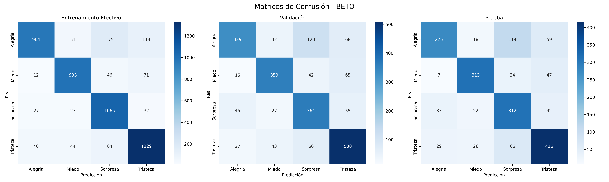
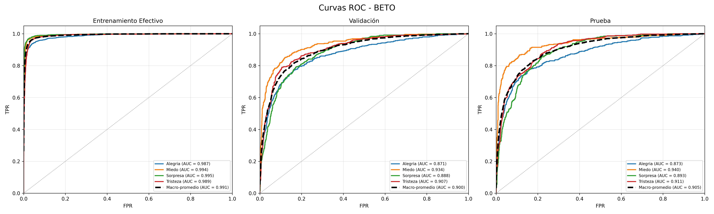
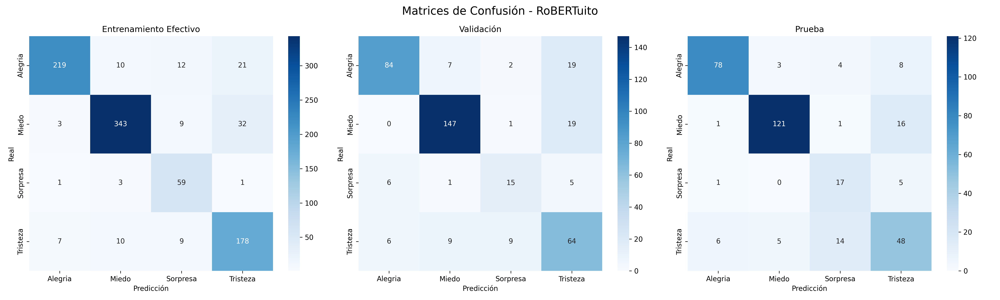
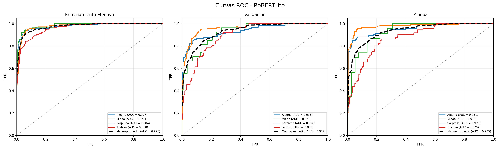

# Reporte de evaluación de modelos Transformer

## BETO

### Resultados en Entrenamiento Efectivo

- **Accuracy:** 0.9389
- **Precision (macro):** 0.9402
- **Recall (macro):** 0.9392
- **F1-Score (macro):** 0.9396

**AUC ROC (Entrenamiento Efectivo):**

- Macro-promedio: 0.9913
- Alegria: 0.9868
- Miedo: 0.9938
- Sorpresa: 0.9952
- Tristeza: 0.9894
  **Reporte por Clase (Entrenamiento Efectivo)**

| Clase    | Precisión | Recall | F1-Score | Soporte |
| -------- | --------- | ------ | -------- | ------- |
| Alegria  | 0.9317    | 0.9103 | 0.9209   | 1304    |
| Miedo    | 0.9459    | 0.9510 | 0.9484   | 1122    |
| Sorpresa | 0.9559    | 0.9459 | 0.9509   | 1147    |
| Tristeza | 0.9272    | 0.9494 | 0.9382   | 1503    |

### Resultados en Validación

- **Accuracy:** 0.7201
- **Precision (macro):** 0.7196
- **Recall (macro):** 0.7154
- **F1-Score (macro):** 0.7167

**AUC ROC (Validación):**

- Macro-promedio: 0.9001
- Alegria: 0.8707
- Miedo: 0.9338
- Sorpresa: 0.8880
- Tristeza: 0.9068

**Reporte por Clase (Validación)**

| Clase    | Precisión | Recall | F1-Score | Soporte |
| -------- | --------- | ------ | -------- | ------- |
| Alegria  | 0.6867    | 0.6941 | 0.6904   | 559     |
| Miedo    | 0.7717    | 0.7588 | 0.7652   | 481     |
| Sorpresa | 0.6864    | 0.6138 | 0.6481   | 492     |
| Tristeza | 0.7335    | 0.7950 | 0.7630   | 644     |

### Resultados en Prueba

- **Accuracy:** 0.7187
- **Precision (macro):** 0.7226
- **Recall (macro):** 0.7164
- **F1-Score (macro):** 0.7189

**AUC ROC (Prueba):**

- Macro-promedio: 0.9045
- Alegria: 0.8729
- Miedo: 0.9396
- Sorpresa: 0.8934
- Tristeza: 0.9110

**Reporte por Clase (Prueba)**

| Clase    | Precisión | Recall | F1-Score | Soporte |
| -------- | --------- | ------ | -------- | ------- |
| Alegria  | 0.6947    | 0.7082 | 0.7014   | 466     |
| Miedo    | 0.8320    | 0.7656 | 0.7974   | 401     |
| Sorpresa | 0.6500    | 0.6357 | 0.6428   | 409     |
| Tristeza | 0.7135    | 0.7561 | 0.7342   | 537     |

### Gráficas Conjuntas

**Matrices de Confusión:**

**Curvas ROC:**

---

## RoBERTuito

### Resultados en Entrenamiento Efectivo

- **Accuracy:** 0.9318
- **Precision (macro):** 0.9326
- **Recall (macro):** 0.9334
- **F1-Score (macro):** 0.9327

**AUC ROC (Entrenamiento Efectivo):**

- Macro-promedio: 0.9885
- Alegria: 0.9816
- Miedo: 0.9921
- Sorpresa: 0.9951
- Tristeza: 0.9850

**Reporte por Clase (Entrenamiento Efectivo)**

| Clase    | Precisión | Recall | F1-Score | Soporte |
| -------- | --------- | ------ | -------- | ------- |
| Alegria  | 0.9357    | 0.8934 | 0.9141   | 1304    |
| Miedo    | 0.9115    | 0.9643 | 0.9372   | 1122    |
| Sorpresa | 0.9584    | 0.9451 | 0.9517   | 1147    |
| Tristeza | 0.9247    | 0.9308 | 0.9277   | 1503    |

### Resultados en Validación

- **Accuracy:** 0.7279
- **Precision (macro):** 0.7255
- **Recall (macro):** 0.7265
- **F1-Score (macro):** 0.7249

**AUC ROC (Validación):**

- Macro-promedio: 0.9051
- Alegria: 0.8866
- Miedo: 0.9344
- Sorpresa: 0.8958
- Tristeza: 0.9026

**Reporte por Clase (Validación)**

| Clase    | Precisión | Recall | F1-Score | Soporte |
| -------- | --------- | ------ | -------- | ------- |
| Alegria  | 0.7191    | 0.7191 | 0.7191   | 559     |
| Miedo    | 0.7220    | 0.8046 | 0.7611   | 481     |
| Sorpresa | 0.7048    | 0.6260 | 0.6631   | 492     |
| Tristeza | 0.7562    | 0.7562 | 0.7562   | 644     |

### Resultados en Prueba

- **Accuracy:** 0.7281
- **Precision (macro):** 0.7258
- **Recall (macro):** 0.7268
- **F1-Score (macro):** 0.7258

**AUC ROC (Prueba):**

- Macro-promedio: 0.9111
- Alegria: 0.8878
- Miedo: 0.9403
- Sorpresa: 0.9029
- Tristeza: 0.9121

**Reporte por Clase (Prueba)**

| Clase    | Precisión | Recall | F1-Score | Soporte |
| -------- | --------- | ------ | -------- | ------- |
| Alegria  | 0.7231    | 0.7060 | 0.7144   | 466     |
| Miedo    | 0.7687    | 0.8204 | 0.7937   | 401     |
| Sorpresa | 0.6737    | 0.6210 | 0.6463   | 409     |
| Tristeza | 0.7378    | 0.7598 | 0.7486   | 537     |

### Gráficas Conjuntas

**Matrices de Confusión:**

**Curvas ROC:**

---
